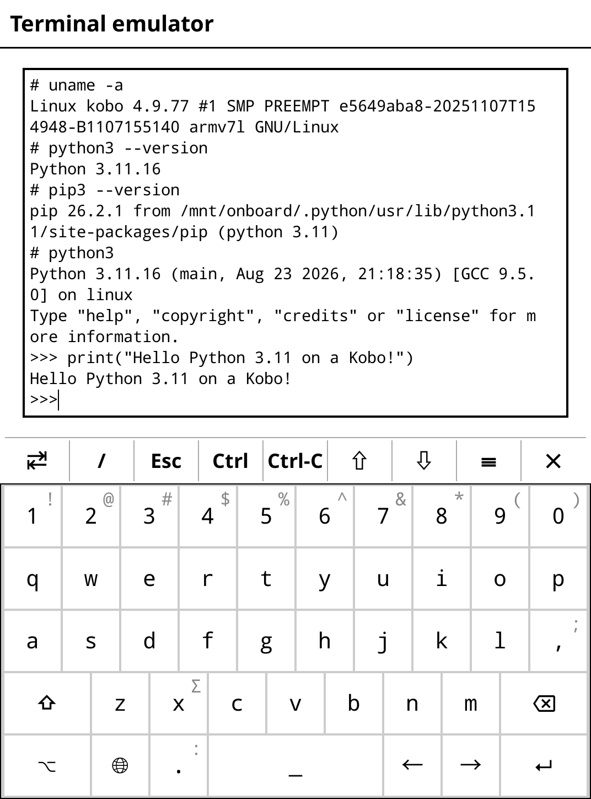

# Kobo Clara Colour (and derivates)
## Python 3.11.16 Cross-Compilation Guide

After countless failed attempts, Docker experiments, sysroot nightmares, and GLIBC version errors, the final result is a fully functional Python 3.11.16 with pip, SSL, sqlite3, lzma, and all essential modules running on the Kobo, for the sake of tinkering =) !

This repository documents the entire process, step by step, from building a custom `crosstool-NG` toolchain to deploying a working Python interpreter on the device's FAT32 user partition. Every step is broken down into its own document under [`DOCS/`](./DOCS), in the exact order they must be followed.

---

## Process Overview

**The entire process is a full headache** that follows this approach:

1. **Toolchain Setup**. The `crosstool-NG` toolchain is built with exact specifications: GLIBC 2.19, GCC 9.5.0, and Linux headers 3.2.101. This ensures all generated binaries are compatible with the Kobo's kernel and libraries.

2. **Build Required Libraries**. Seven essential libraries are cross-compiled using the toolchain: OpenSSL (SSL/TLS), zlib, bzip2, libffi, libuuid, lzma, and sqlite3. These provide Python's core functionality (HTTPS, compression, UUID, etc.).

3. **Pre-requisites Before Building Python**. Python 3.11.16 requires a matching Python 3.11 interpreter on the host. This step compiles a native (x86_64) Python 3.11.16 and creates a virtual environment to serve as `--with-build-python` during cross-compilation.

4. **Cross-Compile Python**. Using the toolchain and compiled libraries, Python 3.11.16 is cross-compiled for ARMv7 (armhf). The `setup.py` file is patched to fix a cross-compilation bug, and the final product is installed to a staging directory.

5. **Latest Fixes Before Deploying**. After the initial installation, several fixes are applied: pip is installed, OpenSSL libraries are copied to staging, shebangs in pip/scripts are corrected to point to the Kobo's Python location, symlinks are removed (FAT32 compatibility), and permissions are set.

6. **Deploy to Kobo**. A FAT32-compatible tarball (without symlinks) is created and copied to the Kobo's user partition (`/mnt/onboard/.python/`). Wrapper scripts are installed in `/usr/bin/` to set environment variables and execute Python from the user partition.

7. **Verification**. Core modules, SSL, and pip are tested directly on the device.

8. **Compiling Compiled pip Modules**. Notes on installing packages that require native compilation (`numpy`, `cryptography`, etc.), which the Kobo itself cannot build.

---

## Approach

- [Part 1: Toolchain Setup](./DOCS/01-toolchain-setup.md)

- [Part 2: Building Required Libraries](./DOCS/02-Building-required-libraries.md)
  - 2.1 Building Each Library
    - 2.1.1 Set Base Environment
    - 2.1.2 Build zlib (1.3.1)
    - 2.1.3 Build bzip2 (1.0.8)
    - 2.1.4 Build libffi (3.4.6)
    - 2.1.5 Build libuuid (util-linux 2.40.2)
    - 2.1.6 Build OpenSSL (1.1.1w)
    - 2.1.7 Build lzma (xz-utils 5.6.2)
    - 2.1.8 Build sqlite3 (3.46.0)

- [Part 3: Pre-requisites Before Building Python](./DOCS/03-Build-host-python-env.md)
  - 3.1 Download and Compile the Host Python
  - 3.2 Create a Python 3.11 Virtual Environment for the Host

- [Part 4: Cross-Compile Python 3.11.16 for the Kobo](./DOCS/04-Crosscompile-kobo-python.md)
  - 4.1 Extract Fresh Python Source for Cross-Compilation
  - 4.2 Fix `setup.py` (CRITICAL)
  - 4.3 Configure Python for Cross-Compilation
    - 4.3.1 Activate the Host Virtual Environment
    - 4.3.2 Set the Cross-Compilation Toolchain
    - 4.3.3 Run `./configure` with All Libraries
    - 4.3.4 Verify Configure Success
  - 4.4 Build Python
    - 4.4.1 Check Build Output
  - 4.5 Install to Staging Directory

- [Part 5: Fixes for Pip, Missing Libraries, Shebangs and Others](./DOCS/05-Fix-PIP-Libraries.md)
  - 5.1 Install Pip to Staging
  - 5.2 Copy OpenSSL Libraries to Staging
  - 5.3 Fix Pip Shebangs
  - 5.4 Fix Any Other Script Shebangs
  - 5.5 Remove Symlinks (FAT32 Compatibility)
  - 5.6 Set Correct Permissions
  - 5.7 Verify Staging Directory Completeness

- [Part 6: Deploying to the Kobo](./DOCS/06-Deploying-to-kobo.md)
  - 6.1 Create FAT32-Compatible Tarball
  - 6.2 Choose Installation Location on Kobo
  - 6.3 Create Python Wrapper Script
  - 6.4 Create Pip Wrapper Script
  - 6.5 Create Convenience Symlinks

- [Part 7: Verification](./DOCS/07-Verify-installation-works.md)
  - 7.1 Test Python
  - 7.2 Test Core Modules
  - 7.3 Test SSL (CRITICAL)
  - 7.4 Test Pip with HTTPS

- [Part 8: Compiling Compiled pip Modules](./DOCS/08-Compiling-compiled-PIP-modules.md)
  - 8.1 pip Works Fine
  - 8.2 Compiled Modules
  - 8.3 How to Install Compiled Modules
    - Option 1: Pre-compiled Wheels (Best)
    - Option 2: Cross-Compile on Your PC

---

## Prerequisites

### Host System
- Debian/Ubuntu x86_64
- Minimum 20GB free disk space
- `build-essential`, and basic development tools
- A proper Python 3.11.16 build environment (see [doc 3](./DOCS/03-Build-host-python-env.md))

### Target Device
- Kobo Clara Colour
- SSH or TELNET access (read how-to [here](https://github.com/alexandrglm/kobo-clara-colour-mods-telnet-ssh-debian-chroot))
- Sufficient space in Kobo's root

> [!WARNING]
> Since the root partition is typically full on most Kobo devices, this guide installs Python on the FAT32 partition (`/mnt/onboard/`) using wrapper scripts. This also solves the symlink issue that FAT32 does not support.

---

## Version Information

| Component | Version |
|-----------|---------|
| **Python** | 3.11.16 |
| **OpenSSL** | 1.1.1w |
| **GLIBC** | 2.19 |
| **GCC** | 9.5.0 |
| **Binutils** | 2.32 |
| **Linux Headers** | 3.2.101 |
| **zlib** | 1.3.1 |
| **bzip2** | 1.0.8 |
| **libffi** | 3.4.6 |
| **util-linux** | 2.40.2 |
| **xz-utils** | 5.6.2 |
| **sqlite3** | 3.46.0 |

---

*Last Updated: August 2026*
